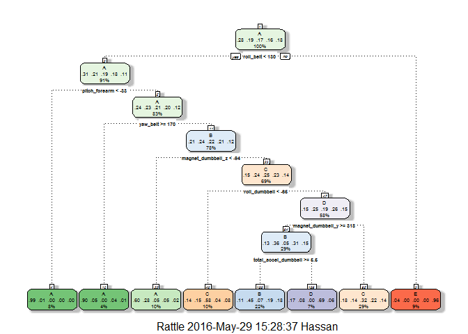

# Practical Machine Learning Final Course Project
Hassan Rabie  
May 27, 2016  

#1-Introduction

Using devices such as Jawbone Up, Nike FuelBand, and Fitbit it is now possible to collect a large amount of data about personal activity relatively inexpensively. These type of devices are part of the quantified self-movement - a group of enthusiasts who take measurements about themselves regularly to improve their health, to find patterns in their behavior, or because they are tech geeks. One thing that people regularly do is quantify how much of a particular activity they do, but they rarely quantify how well they do it. 

In this project, our goal will be to use data from accelerometers on the belt, forearm, arm, and dumbell of 6 participants. They were asked to perform barbell lifts correctly and incorrectly in 5 different ways, to predict the manner in which people did their exercise. This is the "classe" variable in the training set. We may use any of the other variables to predict with. we should create a report describing how you built your model, how you used cross validation, what you think the expected out of sample error is, and why you made the choices you did. You will also use your prediction model to predict 20 different test cases.


#2-Data

The training data for this project are available here:

https://d396qusza40orc.cloudfront.net/predmachlearn/pml-training.csv

The test data are available here:

https://d396qusza40orc.cloudfront.net/predmachlearn/pml-testing.csv

#3-Loading Data
After downloading data, Copy the data to the default directory of R

```r
BasicTraining <- read.csv("pml-training.csv")
TestingFinal <- read.csv("pml-testing.csv")
library(caret)
```

```
## Loading required package: lattice
```

```
## Loading required package: ggplot2
```

```r
library(rattle)
```

```
## Rattle: A free graphical interface for data mining with R.
## Version 4.1.0 Copyright (c) 2006-2015 Togaware Pty Ltd.
## Type 'rattle()' to shake, rattle, and roll your data.
```

```r
library(rpart.plot)
```

```
## Loading required package: rpart
```

```r
library(AppliedPredictiveModeling)
```

#4-Data Cleaning 
After downloading data, and Copying the data into the default directory of R

```r
#Removing na columns
BasicTraining=BasicTraining[ , !apply(BasicTraining, 2 , function(x) sum(is.na(x))>0 ) ]
#Removing Empty columns
BasicTraining= BasicTraining[ , !apply(BasicTraining, 2 , function(x) sum(x=='')>0 ) ]
#Removing unnecessary columns
BasicTraining<- BasicTraining[,7:length(colnames(BasicTraining))]
#checking covariates that have virtually no variablility
NZV <- nearZeroVar(BasicTraining, saveMetrics=TRUE)
#No variable will be removed since all of the near zero variance variables are FALSE
nrow(BasicTraining)
```

```
## [1] 19622
```

```r
#Dividing the BasicTraining into two parts

set.seed(1000)
inTraining <- createDataPartition(y=BasicTraining$classe, p=0.6, list=FALSE)
Training <-BasicTraining[inTraining,]
Testing<-BasicTraining[-inTraining,]
```

#5-Predicting with trees (rpart method)

In this section, we will train the dataset Training without using cross validation and get the out-of-sample error of Testing dataset. Then we will apply the model on the Testing final dataset and reporting the results


```r
set.seed(1000)
fitmodel<-train(classe ~ . , method="rpart", data=Training)
print(fitmodel$finalModel)
```

```
## n= 11776 
## 
## node), split, n, loss, yval, (yprob)
##       * denotes terminal node
## 
##   1) root 11776 8428 A (0.28 0.19 0.17 0.16 0.18)  
##     2) roll_belt< 129.5 10707 7401 A (0.31 0.21 0.19 0.18 0.11)  
##       4) pitch_forearm< -33.15 961    9 A (0.99 0.0094 0 0 0) *
##       5) pitch_forearm>=-33.15 9746 7392 A (0.24 0.23 0.21 0.2 0.12)  
##        10) yaw_belt>=169.5 504   52 A (0.9 0.054 0 0.042 0.0079) *
##        11) yaw_belt< 169.5 9242 6999 B (0.21 0.24 0.22 0.21 0.12)  
##          22) magnet_dumbbell_z< -93.5 1128  456 A (0.6 0.28 0.051 0.051 0.023) *
##          23) magnet_dumbbell_z>=-93.5 8114 6117 C (0.15 0.24 0.25 0.23 0.14)  
##            46) roll_dumbbell< -64.76216 1234  513 C (0.14 0.15 0.58 0.04 0.077) *
##            47) roll_dumbbell>=-64.76216 6880 5078 D (0.15 0.25 0.19 0.26 0.15)  
##              94) magnet_dumbbell_y>=317.5 3430 2184 B (0.13 0.36 0.053 0.31 0.15)  
##               188) total_accel_dumbbell>=5.5 2637 1452 B (0.11 0.45 0.068 0.19 0.18) *
##               189) total_accel_dumbbell< 5.5 793  246 D (0.17 0.077 0.0013 0.69 0.061) *
##              95) magnet_dumbbell_y< 317.5 3450 2355 C (0.18 0.14 0.32 0.22 0.14) *
##     3) roll_belt>=129.5 1069   42 E (0.039 0 0 0 0.96) *
```

```r
fancyRpartPlot(fitmodel$finalModel)
```

<!-- -->

```r
Prediction <- predict(fitmodel, newdata=Testing)
print(confusionMatrix(Prediction, Testing$classe))
```

```
## Confusion Matrix and Statistics
## 
##           Reference
## Prediction    A    B    C    D    E
##          A 1330  239   32   73   17
##          B  196  767  113  343  331
##          C  563  463 1223  529  394
##          D  111   49    0  341   28
##          E   32    0    0    0  672
## 
## Overall Statistics
##                                           
##                Accuracy : 0.5523          
##                  95% CI : (0.5412, 0.5633)
##     No Information Rate : 0.2845          
##     P-Value [Acc > NIR] : < 2.2e-16       
##                                           
##                   Kappa : 0.4386          
##  Mcnemar's Test P-Value : < 2.2e-16       
## 
## Statistics by Class:
## 
##                      Class: A Class: B Class: C Class: D Class: E
## Sensitivity            0.5959  0.50527   0.8940  0.26516  0.46602
## Specificity            0.9357  0.84466   0.6991  0.97134  0.99500
## Pos Pred Value         0.7865  0.43829   0.3856  0.64461  0.95455
## Neg Pred Value         0.8535  0.87680   0.9690  0.87085  0.89219
## Prevalence             0.2845  0.19347   0.1744  0.16391  0.18379
## Detection Rate         0.1695  0.09776   0.1559  0.04346  0.08565
## Detection Prevalence   0.2155  0.22304   0.4043  0.06742  0.08973
## Balanced Accuracy      0.7658  0.67496   0.7966  0.61825  0.73051
```

```r
Predict20problem1<- predict(fitmodel, newdata=TestingFinal)
Predict20problem1
```

```
##  [1] C B B C C C B B A A C C C A B C C D C B
## Levels: A B C D E
```

as the confusion matrix shows that the accuracy of the model is 0.55

In this section, we will train the dataset Training using cross validation and get the out-of-sample error of Testing dataset.


```r
set.seed(1000)
fitmodel <- train(classe ~ .,  preProcess=c("center", "scale"), trControl=trainControl(method = "cv", number = 4), data = Training, method="rpart")
print(fitmodel$finalModel)
```

```
## n= 11776 
## 
## node), split, n, loss, yval, (yprob)
##       * denotes terminal node
## 
##   1) root 11776 8428 A (0.28 0.19 0.17 0.16 0.18)  
##     2) roll_belt< 1.038134 10707 7401 A (0.31 0.21 0.19 0.18 0.11)  
##       4) pitch_forearm< -1.568679 961    9 A (0.99 0.0094 0 0 0) *
##       5) pitch_forearm>=-1.568679 9746 7392 A (0.24 0.23 0.21 0.2 0.12)  
##        10) yaw_belt>=1.894806 504   52 A (0.9 0.054 0 0.042 0.0079) *
##        11) yaw_belt< 1.894806 9242 6999 B (0.21 0.24 0.22 0.21 0.12)  
##          22) magnet_dumbbell_z< -0.9960037 1128  456 A (0.6 0.28 0.051 0.051 0.023) *
##          23) magnet_dumbbell_z>=-0.9960037 8114 6117 C (0.15 0.24 0.25 0.23 0.14)  
##            46) roll_dumbbell< -1.259013 1234  513 C (0.14 0.15 0.58 0.04 0.077) *
##            47) roll_dumbbell>=-1.259013 6880 5078 D (0.15 0.25 0.19 0.26 0.15)  
##              94) magnet_dumbbell_y>=0.2947424 3430 2184 B (0.13 0.36 0.053 0.31 0.15)  
##               188) total_accel_dumbbell>=-0.8061613 2637 1452 B (0.11 0.45 0.068 0.19 0.18) *
##               189) total_accel_dumbbell< -0.8061613 793  246 D (0.17 0.077 0.0013 0.69 0.061) *
##              95) magnet_dumbbell_y< 0.2947424 3450 2355 C (0.18 0.14 0.32 0.22 0.14) *
##     3) roll_belt>=1.038134 1069   42 E (0.039 0 0 0 0.96) *
```

```r
fancyRpartPlot(fitmodel$finalModel)
```

<!-- -->

```r
Prediction <- predict(fitmodel, newdata=Testing)
print(confusionMatrix(Prediction, Testing$classe))
```

```
## Confusion Matrix and Statistics
## 
##           Reference
## Prediction    A    B    C    D    E
##          A 1330  239   32   73   17
##          B  196  767  113  343  331
##          C  563  463 1223  529  394
##          D  111   49    0  341   28
##          E   32    0    0    0  672
## 
## Overall Statistics
##                                           
##                Accuracy : 0.5523          
##                  95% CI : (0.5412, 0.5633)
##     No Information Rate : 0.2845          
##     P-Value [Acc > NIR] : < 2.2e-16       
##                                           
##                   Kappa : 0.4386          
##  Mcnemar's Test P-Value : < 2.2e-16       
## 
## Statistics by Class:
## 
##                      Class: A Class: B Class: C Class: D Class: E
## Sensitivity            0.5959  0.50527   0.8940  0.26516  0.46602
## Specificity            0.9357  0.84466   0.6991  0.97134  0.99500
## Pos Pred Value         0.7865  0.43829   0.3856  0.64461  0.95455
## Neg Pred Value         0.8535  0.87680   0.9690  0.87085  0.89219
## Prevalence             0.2845  0.19347   0.1744  0.16391  0.18379
## Detection Rate         0.1695  0.09776   0.1559  0.04346  0.08565
## Detection Prevalence   0.2155  0.22304   0.4043  0.06742  0.08973
## Balanced Accuracy      0.7658  0.67496   0.7966  0.61825  0.73051
```

```r
Predict20problem2<- predict(fitmodel, newdata=TestingFinal)
Predict20problem2
```

```
##  [1] C B B C C C B B A A C C C A B C C D C B
## Levels: A B C D E
```
as the confusion matrix shows that the accuracy of the model is .55 

#6-Using Random Forest 
In this section, we will train the dataset Training by using Random forest with cross validtion as mentioned in the video lecture and get the out-of-sample error of Testing dataset.

```r
fitControl <- trainControl(method = "cv", number = 4)
fito <- train(classe ~ ., method="rf",data=Training,trControl = fitControl)
```

```
## Loading required package: randomForest
```

```
## randomForest 4.6-12
```

```
## Type rfNews() to see new features/changes/bug fixes.
```

```
## 
## Attaching package: 'randomForest'
```

```
## The following object is masked from 'package:ggplot2':
## 
##     margin
```

```r
print(fito)
```

```
## Random Forest 
## 
## 11776 samples
##    52 predictor
##     5 classes: 'A', 'B', 'C', 'D', 'E' 
## 
## No pre-processing
## Resampling: Cross-Validated (4 fold) 
## Summary of sample sizes: 8833, 8832, 8831, 8832 
## Resampling results across tuning parameters:
## 
##   mtry  Accuracy   Kappa    
##    2    0.9881966  0.9850668
##   27    0.9894706  0.9866800
##   52    0.9853092  0.9814158
## 
## Accuracy was used to select the optimal model using  the largest value.
## The final value used for the model was mtry = 27.
```

```r
Predictions <- predict(fito, newdata=Testing)
print(confusionMatrix(Predictions, Testing$classe))
```

```
## Confusion Matrix and Statistics
## 
##           Reference
## Prediction    A    B    C    D    E
##          A 2228   22    0    0    0
##          B    4 1494   11    1    1
##          C    0    2 1352   25    2
##          D    0    0    5 1260    5
##          E    0    0    0    0 1434
## 
## Overall Statistics
##                                           
##                Accuracy : 0.9901          
##                  95% CI : (0.9876, 0.9921)
##     No Information Rate : 0.2845          
##     P-Value [Acc > NIR] : < 2.2e-16       
##                                           
##                   Kappa : 0.9874          
##  Mcnemar's Test P-Value : NA              
## 
## Statistics by Class:
## 
##                      Class: A Class: B Class: C Class: D Class: E
## Sensitivity            0.9982   0.9842   0.9883   0.9798   0.9945
## Specificity            0.9961   0.9973   0.9955   0.9985   1.0000
## Pos Pred Value         0.9902   0.9887   0.9790   0.9921   1.0000
## Neg Pred Value         0.9993   0.9962   0.9975   0.9960   0.9988
## Prevalence             0.2845   0.1935   0.1744   0.1639   0.1838
## Detection Rate         0.2840   0.1904   0.1723   0.1606   0.1828
## Detection Prevalence   0.2868   0.1926   0.1760   0.1619   0.1828
## Balanced Accuracy      0.9971   0.9908   0.9919   0.9891   0.9972
```

```r
Predict20problem3<- predict(fitmodel, newdata=TestingFinal)
Predict20problem3
```

```
##  [1] C B B C C C B B A A C C C A B C C D C B
## Levels: A B C D E
```
as the confusion matrix shows that the accuracy of the model is .99 

#7-Conclusion 
In the above sections we compare between three different methods to predict the 20 problems the best model was the Random forest algorithm with accuracy  therefore we used it for solve the assignment.
